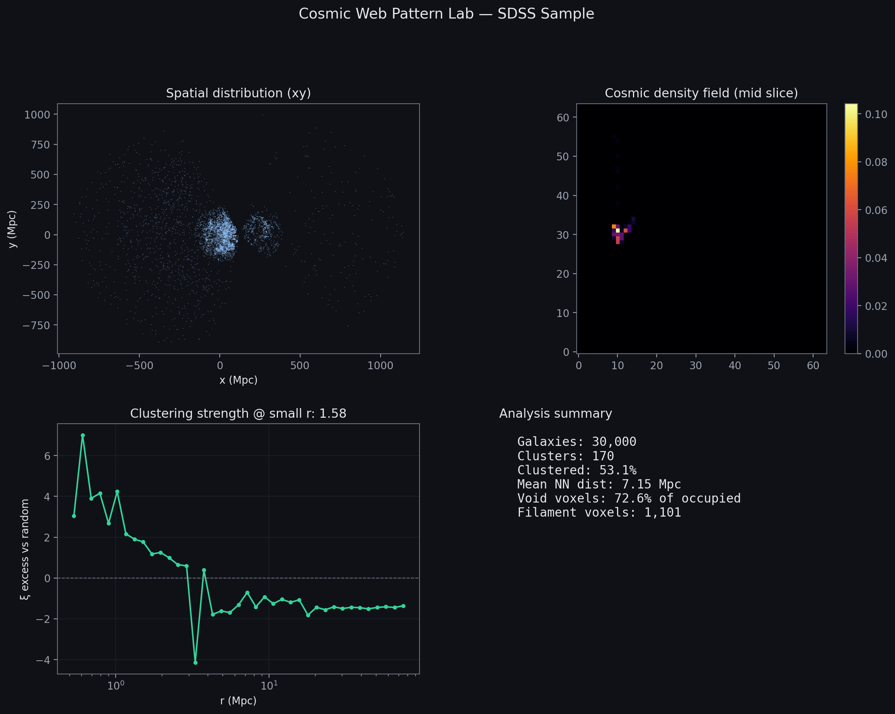

# Cosmic Web Pattern Lab

## What is this?

I pulled ~30k galaxies from SDSS (real survey data, not made up), turned them into a 3D map, and checked if they're scattered randomly or clumped up like people say the "cosmic web" should look.




## What I actually did

1. Download `ra`, `dec`, redshift from SDSS  
2. Convert to comoving xyz in Mpc (Astropy + Planck18)  
3. Bin positions into a 64³ density grid  
4. Run DBSCAN for groups, flag low-density "void" voxels, compare two-point correlation to a **random uniform** catalog in the same box  
5. Train a 3D conv autoencoder on 16³ patches — high reconstruction error = weird local density

- 30,000 galaxies, z between 0.01 and 0.25  
- DBSCAN found **170** clusters; ~53% of galaxies landed in a cluster  
- Biggest two clusters had ~4.2k and ~3.9k galaxies  
- Median distance to nearest neighbor: **~2 Mpc** (so lots of close pairs)  
- Correlation vs random: small-scale excess around **~1.6** — galaxies sit closer than a random sprinkle in the same volume  


## Plots worth opening

| file | what it is |
|------|------------|
| `results/correlation_comparison.png` | SDSS vs random — main "not random" plot |
| `results/positions_clusters.png` | xy map colored by cluster |
| `results/density_structure.png` | density slice + void/filament masks |
| `results/anomaly_patches.png` | autoencoder struggled most on these patches |

## Run it

```bash
python -m venv .venv
# windows: .venv\Scripts\activate
pip install -r requirements.txt
python run.py all
```

First run hits SDSS over the network and saves `data/galaxies.csv`. After that you can redo analysis without re-downloading:

```bash
python run.py patterns
python run.py viz
python run.py analyze
```

## Stack

Python, TensorFlow, Astropy, astroquery, scikit-learn, matplotlib.

## Caveats (read this if you're an astronomer)

This is a portfolio / learning project. The correlation estimator is simplified, the grid is only 64³, and the autoencoder has no labels — "anomalies" just mean atypical patches, not discoveries.

Data: [SDSS](https://www.sdss.org/).
