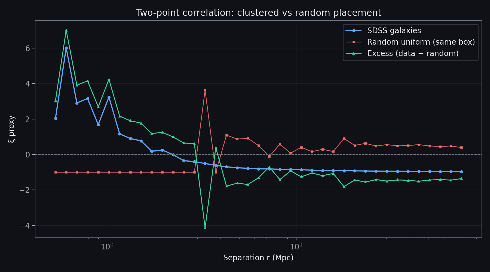
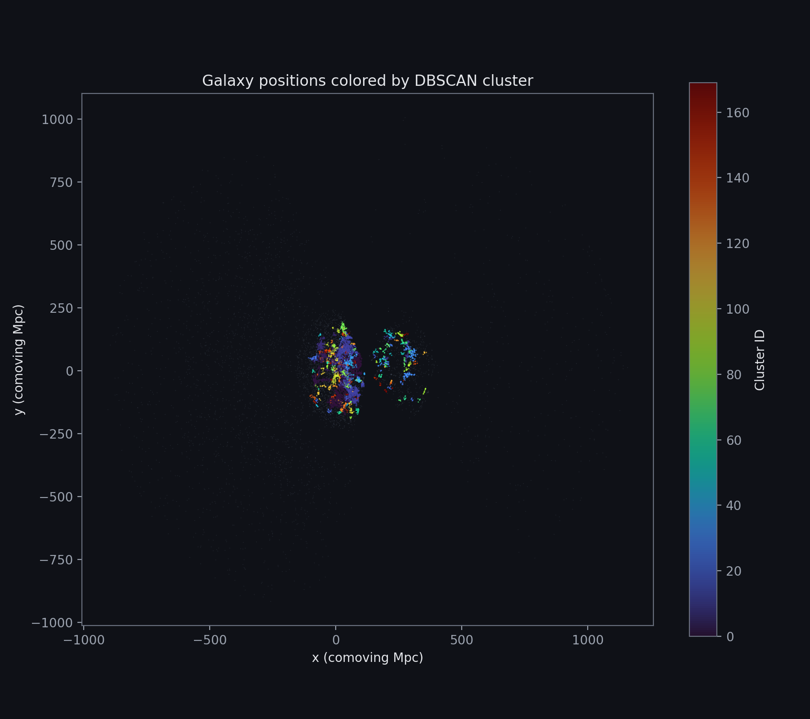
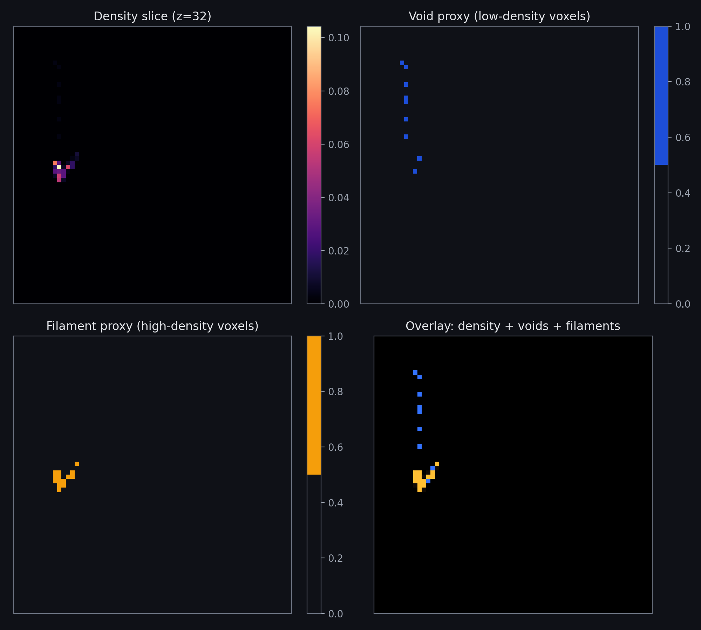
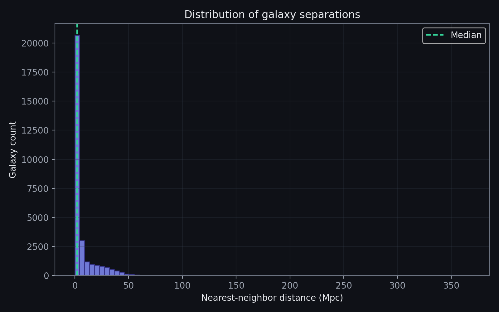
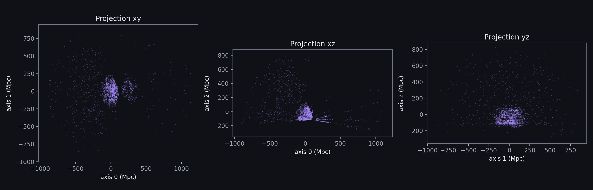
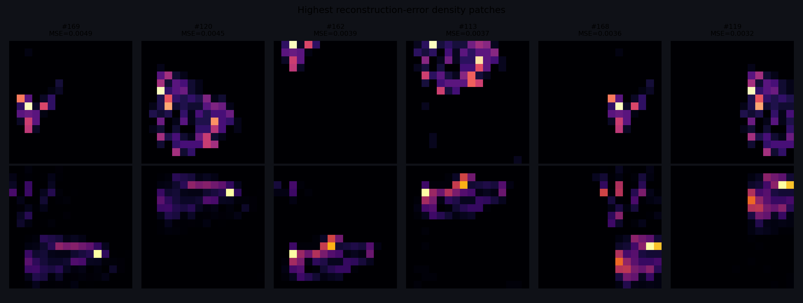
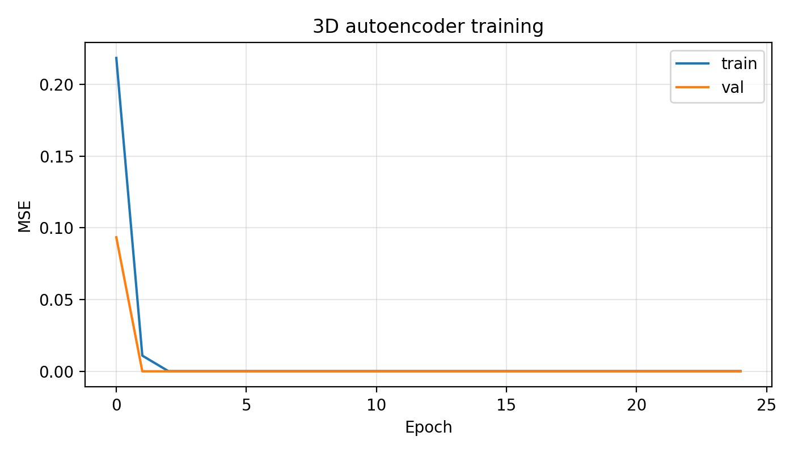

# Cosmic Web Pattern Lab

## What is this?

I mapped around 30000 galaxies from the from the Sloan Digital Sky Survey (SDSS) into 3D moving space and tested whether their positions are random or actually make sense with modern physics and large-scale structure of cosmic web.

## What I actually did

Step by step, no jargon wall.

**1. Get galaxy data from SDSS**  
I downloaded ~**30,000 galaxies** from the Sloan Digital Sky Survey. Each one has a spot on the sky (right ascension + declination) and a **redshift** (how stretched the light is). We use redshift to guess how far away it is.

**2. Make a 3D map**  
RA and dec only tell you a direction. They do not give you a full position in space. I used normal astronomy code to turn each galaxy into **x, y, z** in megaparsecs (Mpc). A megaparsec is just a giant distance unit. After this you get a **cloud of points in a box**. That box is our little slice of the universe.

**3. Count galaxies in a grid**  
I chopped the box into **64 x 64 x 64** tiny cubes (think Minecraft). I counted how many galaxies landed in each cube. **Hot spots** = lots of galaxies. **Cold spots** = almost none. That grid is a rough map of clumps and holes. It is not a telescope photo.

**4. Check patterns vs random**  
- **Grouping:** I ran DBSCAN. It finds tight clusters of points. Random scatter would not give you this many big clumps.  
- **Voids:** Cubes with almost no galaxies = empty-ish gaps between the clumps.  
- **Correlation:** I checked if galaxy pairs sit closer than you'd get if you shuffled the same 30k points inside the same box. If real data beats random, the structure is real, not luck.

**5. ML bit**  
I cut the grid into **16 x 16 x 16** chunks and trained a **3D autoencoder** to rebuild them. Most chunks look the same (mostly empty, few bright cells). Where the model messes up the rebuild, that chunk looks **weird** compared to the rest. That is not a named discovery. It is just "this patch looks off."

### What the numbers said (my run)

- **30,000 galaxies**, redshift about **0.01 to 0.25** (close-ish in cosmic terms).  
- **170 groups** from DBSCAN. About **53%** of galaxies landed in some group. The rest were loners or in-between.  
- The **two biggest groups** had ~**4,200** and ~**3,900** galaxies. That is fat clumps in this sample.  
- **Median gap to your nearest neighbor: ~2 Mpc.** Lots of galaxies sit way closer to another one than you'd expect from random sprinkling.  
- **Vs a random catalog in the same box:** clustering score was about **1.6x** higher at small scales. Plain English: galaxies like having neighbors nearby more than random points do.


## Results (plots)

All figures are in `results/` if you clone the repo. They also show up here on GitHub — no need to open files one by one.

### Overview


### Are galaxies clumped vs random?

Blue = real SDSS sample. Red = same number of points placed randomly in the same box. Green = the difference. If structure is real, the green line should sit above zero on the left (small separations).



### Where the groups are

Each color is a DBSCAN cluster. Gray = not assigned to a cluster. You can see big clumps instead of an even sprinkle.



### Density, voids, and filaments

Top row: how many galaxies per voxel. Bottom row: low-density “void” areas (blue) and high-density “filament” areas (orange) on top of the map.



### How far apart galaxies sit

Histogram of “distance to your closest neighbor.” The spike on the left means many galaxies have a nearby buddy — another sign they are not random.



### Three views of the same cloud

Same 30k points seen from xy, xz, and yz — helps see depth and filaments.



### ML: unusual density patches

The autoencoder struggled most on these small 3D chunks (higher reconstruction error = less “typical” for this dataset).





## Run it

```bash
python -m venv .venv
# windows: .venv\Scripts\activate
pip install -r requirements.txt
python run.py all
```

First run hits SDSS over the network and saves `data/galaxies.csv`. After that you can redo analysis without re-downloading:

```bash
python run.py patterns
python run.py viz
python run.py analyze
```

## Stack

Python, TensorFlow, Astropy, astroquery, scikit-learn, matplotlib.

## Caveats (read this if you're an astronomer)

This is a portfolio / learning project. The correlation estimator is simplified, the grid is only 64³, and the autoencoder has no labels — "anomalies" just mean atypical patches, not discoveries.

Data: [SDSS](https://www.sdss.org/).
